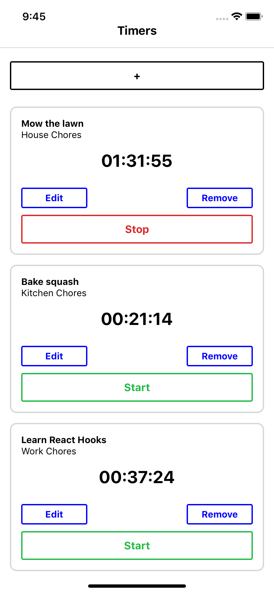

# Time tracker

<p align="center">
  <a href="https://www.fullstackreact.com/react-native/">
    
  </a>
</p>

<h3 align="center">
  Time tracker
</h3>
  
  <a href="https://www.fullstackreact.com/react-native/">
    <p align="center">
      Following Fullstack React Native book
    </p>
  </a>

## Differences from the book

It's a simple app from the second chapter of the book

- All the class based components are transformed to **function components**
- Uses **React Hooks** in all of them

## Preview

## [Try it on Expo](https://exp.host/@jkhusanov/Time-tracking)



## Getting started

```
git clone https://github.com/jkhusanov/time-tracker.git

cd time-tracker

yarn install

expo start

i
```

## Feedback

In case you have any feedback or questions, feel free to open a new issue on this repo or reach out to me [**@jkhusanov**](https://github.com/jkhusanov) on Github.
